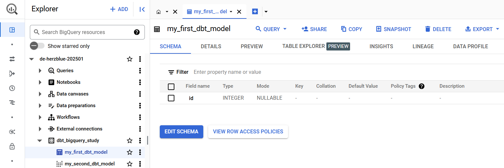
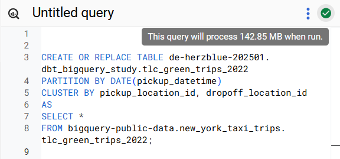
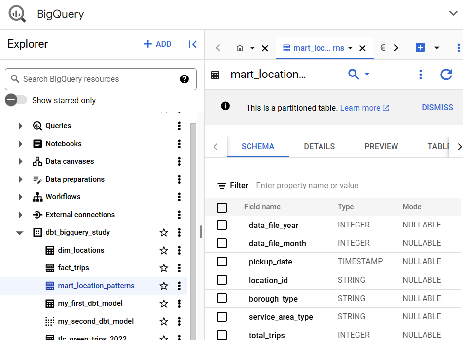

카일님의 dbt+bigquery 블로그글을 참고하여 dbt+bigquery 테스트한 내용을 정리함
참고: 
- https://zzsza.github.io/data-engineering/2025/01/30/dbt-with-bigquery/
- https://docs.getdbt.com/reference/resource-configs/bigquery-configs

## 1. dbt + BigQuery를 위한 환경 설정

### 1-1. dbt + BigQuery를 위한 환경 설정

#### [1] dbt bigquery 설치

poetry add dbt-bigquery                                                                                             
poetry shell
#### [2] dbt init
```bash
~/dbt-bigquery-study ❯ dbt init                                                                              39s dbt-bigquery-study-py3.12 16:22:37
07:23:18  Running with dbt=1.9.2
Enter a name for your project (letters, digits, underscore): dbt_bigquery_study
07:23:20  
Your new dbt project "dbt_bigquery_study" was created!

For more information on how to configure the profiles.yml file,
please consult the dbt documentation here:

  https://docs.getdbt.com/docs/configure-your-profile

One more thing:

Need help? Don't hesitate to reach out to us via GitHub issues or on Slack:

  https://community.getdbt.com/

Happy modeling!

07:23:20  Setting up your profile.
Which database would you like to use?
[1] bigquery

(Don't see the one you want? https://docs.getdbt.com/docs/available-adapters)

Enter a number: 1
[1] oauth
[2] service_account
Desired authentication method option (enter a number): 2
keyfile (/path/to/bigquery/keyfile.json): 2
project (GCP project id): de-herzblue-202501
dataset (the name of your dbt dataset): dbt_bigquery_study
threads (1 or more): 4
job_execution_timeout_seconds [300]: 
[1] US
[2] EU
Desired location option (enter a number): 1
07:36:48  Profile dbt_bigquery_study written to /home/herzblue/.dbt/profiles.yml using target's profile_template.yml and your supplied values. Run 'dbt debug' to validate the connection.
```
#### [3] gcloud를 사용해 oauth (나는 service_account 인증을 사용)

```bash
gcloud auth application-default login \
  --scopes=https://www.googleapis.com/auth/bigquery,\
https://www.googleapis.com/auth/drive.readonly,\
https://www.googleapis.com/auth/iam.test
```

#### [4] dbt run
- 샘플 모델을 실행
	- `models/example` 폴더에 있는 my\_first\_dbt\_model.sql, my\_second\_dbt\_model.sql가 실행됨

```bash
dbt run
```

- 실행하면 BigQuery에 새로운 테이블, 뷰가 추가됨

```bash
~/dbt-bigquery-study/dbt_bigquery_study main* ❯ dbt run                                                          dbt-bigquery-study-py3.12 16:57:00
07:57:04  Running with dbt=1.9.2
07:57:05  Registered adapter: bigquery=1.9.1
07:57:06  Found 2 models, 4 data tests, 489 macros
07:57:06  
07:57:06  Concurrency: 4 threads (target='dev')
07:57:06  
07:57:07  1 of 2 START sql table model dbt_bigquery_study.my_first_dbt_model ............. [RUN]
07:57:11  1 of 2 OK created sql table model dbt_bigquery_study.my_first_dbt_model ........ [CREATE TABLE (2.0 rows, 0 processed) in 4.01s]
07:57:11  2 of 2 START sql view model dbt_bigquery_study.my_second_dbt_model ............. [RUN]
07:57:13  2 of 2 OK created sql view model dbt_bigquery_study.my_second_dbt_model ........ [CREATE VIEW (0 processed) in 1.76s]
07:57:13  
07:57:13  Finished running 1 table model, 1 view model in 0 hours 0 minutes and 7.30 seconds (7.30s).
07:57:13  
07:57:13  Completed successfully
07:57:13  
07:57:13  Done. PASS=2 WARN=0 ERROR=0 SKIP=0 TOTAL=2
```


#### [5] dbt utils 설정

- dbt\_utils는 dbt에서 유용하게 사용할 수 있는 macro와 Test를 모아둔 패키지
- packages.yml 파일에 dbt\_utils 패키지를 추가(이 파일이 없다면 생성하고 추가하면 됨)

```yaml
packages:
  - package: dbt-labs/dbt_utils
    version: 1.3.0
```

- 그 후, `dbt deps`를 실행해 디펜던시를 설치함

```bash
~/dbt-bigquery-study/dbt_bigquery_study main* ❯ dbt deps                                                     12s dbt-bigquery-study-py3.12 16:57:15
08:05:48  Running with dbt=1.9.2
08:05:48  Updating lock file in file path: /home/herzblue/dbt-bigquery-study/dbt_bigquery_study/package-lock.yml
08:05:48  Installing dbt-labs/dbt_utils
08:05:49  Installed from version 1.3.0
08:05:49  Up to date!
```

#### [6] 사용할 데이터

- BigQuery의 Public Data인 뉴욕 택시 데이터인 tlc\_green\_trips\_2022 테이블을 사용
- Source 데이터 설정
- `models/sources.yml`에 소스 데이터를 설정해서, dbt 모델링을 할 때 사용할 수 있음
- BigQuery Public 데이터인 `tlc_green_trips_2022`을 사용할 예정이나, 이 테이블은 파티션 설정이 되어있지 않아 전체를 복사한 후 파티션을 설정할 예정

#### [7] tlc\_green\_trips\_2022 테이블 파티션 설정

- 아래 쿼리를 실행해 Public이 아닌 자신의 프로젝트의 데이터셋에 저장

```plaintext
CREATE OR REPLACE TABLE newyork_taxi.tlc_green_trips_2022
PARTITION BY DATE(pickup_datetime)
CLUSTER BY pickup_location_id, dropoff_location_id
AS
SELECT *
FROM bigquery-public-data.new_york_taxi_trips.tlc_green_trips_2022;
```


#### [8] 테이블 정보 저장

- `models/sources.yml`에 다음과 같이 저장
- 처음에 헷갈릴 수 있는 부분은, database, schema, tables 개념인데 핵심만 정리하면 다음과 같음
    - database는 구글 클라우드 프로젝트 ID
    - schema는 빅쿼리 데이터셋
    - tables의 name은 테이블 이름
- tests 부분은 임의로 추가함. 실제로 잘 통과되는 test도 있고, 통과되지 않을 test도 존재

```yaml
version: 2

sources:
  - name: ny_taxi # dbt에서 사용할 이름
    database: de-herzblue-202501 # 구글 클라우드 프로젝트 ID
    schema: dbt_bigquery_study # 빅쿼리 데이터셋 이름
    description: "뉴욕 택시 운행 데이터의 파티션된 버전"
    
    tables:
      - name: tlc_green_trips_2022 # 빅쿼리 테이블 이름
        description: "녹색 택시(Green Taxi)의 운행 기록 데이터. 일자별로 파티션되어 있음"
        
        loaded_at_field: pickup_datetime

        columns:
          - name: vendor_id
            description: "택시 제공업체 식별자"
            tests:
              - not_null
              - accepted_values:
                  values: ['1', '2']

          - name: pickup_datetime
            description: "승객 탑승 시간"
            tests:
              - not_null

          - name: dropoff_datetime
            description: "승객 하차 시간"
            tests:
              - not_null
              - dbt_utils.expression_is_true:
                  expression: "dropoff_datetime >= pickup_datetime"

          - name: store_and_fwd_flag
            description: "저장 후 전송 여부 (Y/N)"
            tests:
              - accepted_values:
                  values: ['Y', 'N']

          - name: rate_code
            description: >
              요금 코드. 운행 유형에 따른 요금 체계를 나타냅니다:
              1.0 = 표준 요금 (Standard rate): 일반적인 시내 운행
              2.0 = JFK 공항 (JFK Airport): 고정 요금이 적용되는 JFK 공항행
              3.0 = Newark 공항 (Newark Airport): Newark 공항 운행
              4.0 = Nassau 또는 Westchester: 교외 지역 운행
              5.0 = 협상 요금 (Negotiated fare): 사전에 합의된 요금
              6.0 = 그룹 승차 (Group ride): 합승 요금
            tests:
              - not_null
              - accepted_values:
                  values: [1.0, 2.0, 3.0, 4.0, 5.0, 6.0]

          - name: passenger_count
            description: "승객 수"

          - name: trip_distance
            description: "주행 거리 (마일)"
            tests:
              - not_null
              - dbt_utils.expression_is_true:
                  expression: "trip_distance >= 0"

          - name: fare_amount
            description: "기본 요금"
            tests:
              - not_null

          - name: extra
            description: "추가 요금"
            tests:
              - not_null

          - name: mta_tax
            description: "MTA 세금"
            tests:
              - not_null

          - name: tip_amount
            description: "팁"
            tests:
              - not_null

          - name: tolls_amount
            description: "통행료"
            tests:
              - not_null

          - name: ehail_fee
            description: "전자 호출 수수료"

          - name: airport_fee
            description: "공항 수수료"

          - name: total_amount
            description: "총 금액"
            tests:
              - not_null
              - dbt_utils.expression_is_true:
                  expression: "total_amount >= 0"

          - name: payment_type
            description: >
              결제 방식을 나타내는 코드:
              1.0 = 신용카드 (Credit card): 카드 결제
              2.0 = 현금 (Cash): 현금 결제
              3.0 = 무료 운행 (No charge): 요금이 부과되지 않는 운행
              4.0 = 분쟁 (Dispute): 요금 관련 분쟁이 있는 경우
              5.0 = 알 수 없음 (Unknown): 결제 방식이 불분명한 경우
              6.0 = 취소된 운행 (Voided trip): 운행이 취소된 경우
            tests:
              - not_null
              - accepted_values:
                  values: [1.0, 2.0, 3.0, 4.0, 5.0, 6.0]

          - name: trip_type
            description: "운행 유형"
            tests:
              - not_null

          - name: imp_surcharge
            description: "개선 부과금"
            tests:
              - not_null

          - name: pickup_location_id
            description: "승차 위치 ID"
            tests:
              - not_null

          - name: dropoff_location_id
            description: "하차 위치 ID"
            tests:
              - not_null

          - name: data_file_year
            description: "데이터 파일의 연도"
            tests:
              - not_null

          - name: data_file_month
            description: "데이터 파일의 월"
            tests:
              - not_null

        # 테이블 수준의 테스트
        tests:
          - dbt_utils.expression_is_true:
              expression: >
                fare_amount + COALESCE(extra, 0) + COALESCE(mta_tax, 0) + 
                COALESCE(tip_amount, 0) + COALESCE(tolls_amount, 0) + 
                COALESCE(imp_surcharge, 0) <= total_amount
              severity: warn
```

### 1-2. 모델링

- locationId 별로 집계하는 간단한 모델을 만들 예정

참고: DBT BigQuery 구성 - https://docs.getdbt.com/reference/resource-configs/bigquery-configs#using-table-partitioning-and-clustering

#### [1] 차원(dimension) 모델링
- pickup\_location\_id의 특정 차원을 저장
- `models/dimensions/dim_locations.sql`

```sql
{{ config( materialized='table', cluster_by=['location_id'] ) }}

SELECT DISTINCT
    pickup_location_id AS location_id,
    -- 위치의 고유한 특성을 정의
    CASE 
        WHEN pickup_location_id IN ("1", "2") THEN 'airport'  -- 공항 위치 ID
        WHEN pickup_location_id BETWEEN "100" AND "200" THEN 'manhattan'
        ELSE 'outer_borough'
    END AS borough_type,
    case
        WHEN pickup_location_id IN ("1", "2") THEN 'restricted'
        ELSE 'general'
    END AS service_area_type
from {{ source('ny_taxi', 'tlc_green_trips_2022') }}
```

#### [2] 팩트(fact) 모델링

- 팩트 테이블은 비즈니스에서 발생하는 이벤트나 트랜잭션을 기록하는 테이블
- 한 번의 택시 운행과 관련된 정보를 저장함

```sql
-- models/facts/fact_trips.sql
{{ config(
    materialized='incremental',
    partition_by={
        "field": "pickup_datetime",
        "data_type": "timestamp",
        "granularity": "day"
    },
    cluster_by=['pickup_location_id', 'dropoff_location_id']
) }}

select
    -- 운행 식별 정보
    
        concat(
        vendor_id, '_',
        cast(pickup_datetime as string), '_',
        cast(pickup_location_id as string)
    ) as trip_id,
    vendor_id,
    
    -- 시간 관련 측정값
    pickup_datetime,
    dropoff_datetime,
    TIMESTAMP_DIFF(dropoff_datetime, pickup_datetime, MINUTE) as duration_minutes,    
    -- 위치 관련 측정값
    pickup_location_id,
    dropoff_location_id,
    trip_distance,
    
    -- 승객 정보
    passenger_count,
    trip_type,
    rate_code,
    store_and_fwd_flag,
    
    -- 요금 관련 측정값
    fare_amount,
    extra,
    mta_tax,
    tip_amount,
    tolls_amount,
    ehail_fee,
    airport_fee,
    imp_surcharge,
    total_amount,
    payment_type,
    
    -- 성과 지표 계산
    case 
        when fare_amount > 0 then tip_amount / fare_amount 
        else 0 
    end as tip_ratio,
    
    case 
        when TIMESTAMP_DIFF(dropoff_datetime, pickup_datetime, MINUTE) > 0 
        then total_amount / TIMESTAMP_DIFF(dropoff_datetime, pickup_datetime, MINUTE)
        else 0 
    end as revenue_per_minute,
    
    -- 파일 정보
    data_file_year,
    data_file_month

from {{ source('ny_taxi', 'tlc_green_trips_2022') }}


where pickup_datetime > (select max(pickup_datetime) from {{ this }})

```

#### [3] 마트(mart) 모델링

- 마트 테이블 : 특정 기준으로 집계한 데이터
- 예 : 일자별, 지역별 운행 통계

```sql
-- models/marts/mart_location_patterns.sql
{{
    config(
        materialized='incremental',
        partition_by={
            "field": "data_file_month",
            "data_type": "int64",
            "granularity": "month",
            "range": {
              "start": 1,
              "end": 12,
              "interval": 1
            }
        },
        cluster_by="location_id,borough_type"
    )
}}

select
    f.data_file_year,
    f.data_file_month,
    date_trunc(f.pickup_datetime, day) as pickup_date, 
    l.location_id,
    l.borough_type,
    l.service_area_type,
    count(distinct f.trip_id) as total_trips,  -- 고유 trip_id 개수
    avg(f.fare_amount) as avg_fare,
    avg(case when f.rate_code = '2.0' then 1 else 0 end) as airport_trip_ratio
from {{ ref('fact_trips') }} f
join {{ ref('dim_locations') }} l
    on f.pickup_location_id = l.location_id

  where f.data_file_month >= (select max(data_file_month) from {{ this }})

group by
    f.data_file_year,
    f.data_file_month,
    pickup_date,
    l.location_id,
    l.borough_type,
    l.service_area_type
```

#### [4] 모델 실행

- mart\_location\_patterns.sql 과 앞선 의존성을 모두 실행
- 실행하면 빅쿼리 테이블이 생성됨

```bash
dbt run --select +mart_location_patterns
```

```bash
~/dbt-bigquery-study/dbt_bigquery_study main* ❯ dbt run --select +mart_location_patterns                         dbt-bigquery-study-py3.12 17:05:50
08:36:02  Running with dbt=1.9.2
08:36:03  Registered adapter: bigquery=1.9.1
08:36:03  Unable to do partial parsing because a project dependency has been added
08:36:06  Found 5 models, 30 data tests, 1 source, 605 macros
08:36:06  
08:36:06  Concurrency: 4 threads (target='dev')
08:36:06  
08:36:08  1 of 3 START sql table model dbt_bigquery_study.dim_locations .................. [RUN]
08:36:08  2 of 3 START sql incremental model dbt_bigquery_study.fact_trips ............... [RUN]
08:36:13  1 of 3 OK created sql table model dbt_bigquery_study.dim_locations ............. [CREATE TABLE (258.0 rows, 3.1 MiB processed) in 4.99s]
08:36:15  2 of 3 OK created sql incremental model dbt_bigquery_study.fact_trips .......... [CREATE TABLE (768.0k rows, 142.8 MiB processed) in 6.89s]
08:36:15  3 of 3 START sql incremental model dbt_bigquery_study.mart_location_patterns ... [RUN]
08:36:20  3 of 3 OK created sql incremental model dbt_bigquery_study.mart_location_patterns  [CREATE TABLE (45.3k rows, 57.1 MiB processed) in 5.25s]
08:36:20  
08:36:20  Finished running 2 incremental models, 1 table model in 0 hours 0 minutes and 13.96 seconds (13.96s).
08:36:20  
08:36:20  Completed successfully
08:36:20  
08:36:20  Done. PASS=3 WARN=0 ERROR=0 SKIP=0 TOTAL=3
```


#### [5] 모델 컴파일 확인

- 만약 모델 실행 전에, 컴파일을 통해 확인하고 싶다면 아래 명령어로 가능함
	- **컴파일** : 실제 실행 가능한 SQL로 변환하는 명령어
		- 변환된 SQL만 생성함
		- 생성된 SQL은 `target/compiled/{project_name}/models/` 에 저장됨

```plaintext
dbt compile --models mart_location_patterns
```

```bash
~/dbt-bigquery-study/dbt_bigquery_study main* ❯ dbt compile --models mart_location_patterns                  22s dbt-bigquery-study-py3.12 17:36:22
08:39:06  Running with dbt=1.9.2
08:39:07  Registered adapter: bigquery=1.9.1
08:39:08  Found 5 models, 30 data tests, 1 source, 605 macros
08:39:08  
08:39:08  Concurrency: 4 threads (target='dev')
08:39:08  
Compiled node 'mart_location_patterns' is:


select
    f.data_file_year,
    f.data_file_month,
    date_trunc(f.pickup_datetime, day) as pickup_date, 
    l.location_id,
    l.borough_type,
    l.service_area_type,
    count(distinct f.trip_id) as total_trips,  -- 고유 trip_id 개수
    avg(f.fare_amount) as avg_fare,
    avg(case when f.rate_code = '2.0' then 1 else 0 end) as airport_trip_ratio
from `de-herzblue-202501`.`dbt_bigquery_study`.`fact_trips` f
join `de-herzblue-202501`.`dbt_bigquery_study`.`dim_locations` l
    on f.pickup_location_id = l.location_id

  where f.data_file_month >= (select max(data_file_month) from `de-herzblue-202501`.`dbt_bigquery_study`.`mart_location_patterns`)

group by
    f.data_file_year,
    f.data_file_month,
    pickup_date,
    l.location_id,
    l.borough_type,
    l.service_area_type
```

#### [6] dbt run을 실행할 때, 오류가 발생한다면

- 컴파일 후 나오는 쿼리문을 BigQuery Console에서 실행 => 오류가 생기면 쿼리가 실행되지 않을 것
- 다 수정했는데도 안된다면 dbt run을 하면서 생성하는 옵션에서 이슈가 있을 수 있음
	- `logs/dbt.log`에서 보면 실행될 시점의 쿼리문을 볼 수 있음
	- 이 쿼리를 보면서 왜 이런 코드가 실행되는지 확인하면 됨

#### [7] dbt docs 생성

- dbt 문서를 생성하는 명령어는 크게 2단계로 진행
    - **generate**: 문서를 생성
    - **serve**: 로컬에서 확인 가능

```bash
dbt docs generate
dbt docs serve
```

- localhost:8080에서 확인할 수 있음


- 그리고 우측 아래의 View Lineage Graph를 클릭하면 리니지 형태를 볼 수 있음


```bash
~/dbt-bigquery-study/dbt_bigquery_study main* ❯ dbt docs generate                                             6s dbt-bigquery-study-py3.12 17:39:10
dbt docs serve
08:40:45  Running with dbt=1.9.2
08:40:46  Registered adapter: bigquery=1.9.1
08:40:46  Found 5 models, 30 data tests, 1 source, 605 macros
08:40:46  
08:40:46  Concurrency: 4 threads (target='dev')
08:40:46  
08:40:48  Building catalog
08:40:52  Catalog written to /home/herzblue/dbt-bigquery-study/dbt_bigquery_study/target/catalog.json
08:40:55  Running with dbt=1.9.2
Serving docs at 8080
To access from your browser, navigate to: http://localhost:8080


Press Ctrl+C to exit.
gio: http://localhost:8080: Operation not supported
```

#### [8] 모델 Test

- dbt test는 sources.yml과 schema.yml에 정의된 테스트를 실행함
    - sources.yml : source의 테이블과 컬럼에 대한 테스트
    - schema.yml : 모델의 테이블과 컬럼에 대한 테스트
	- 여기선 sources.yml에 정의된 테스트를 실행함
```
dbt test
```

- 명령어를 실행하면, 통과되지 못한 Test가 나옴. 이 Test를 수정하면 됨


